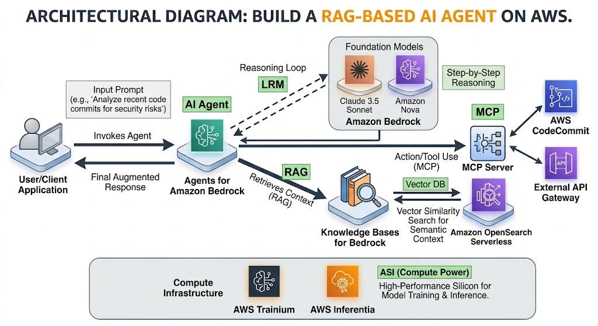
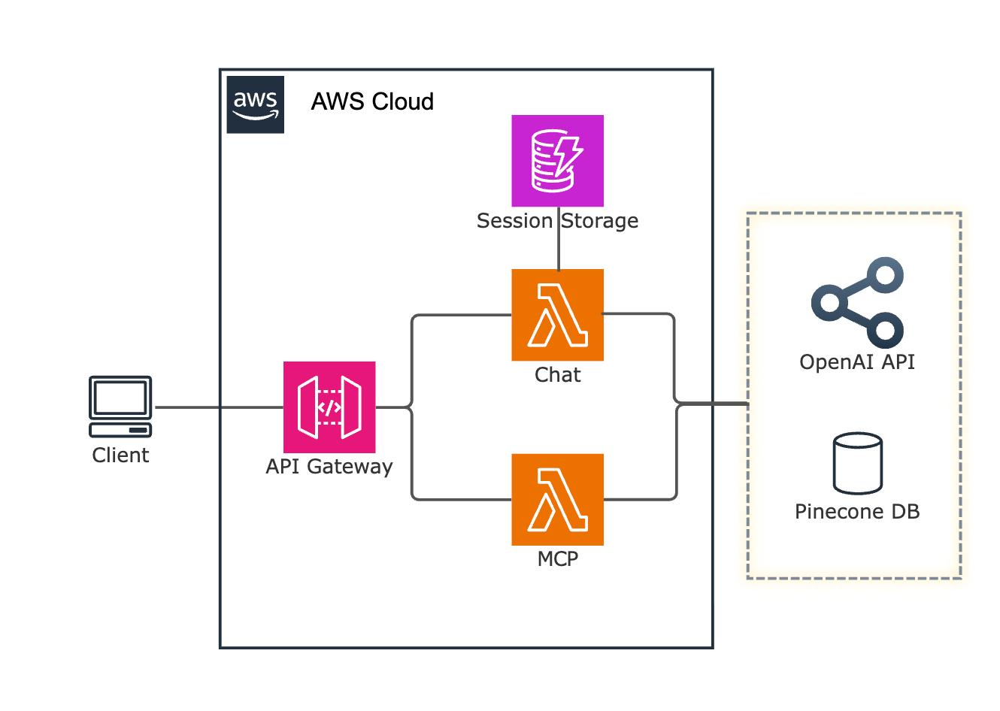
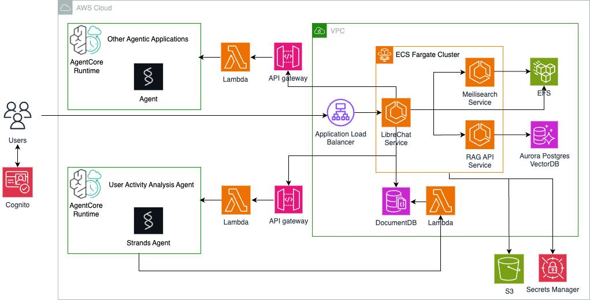
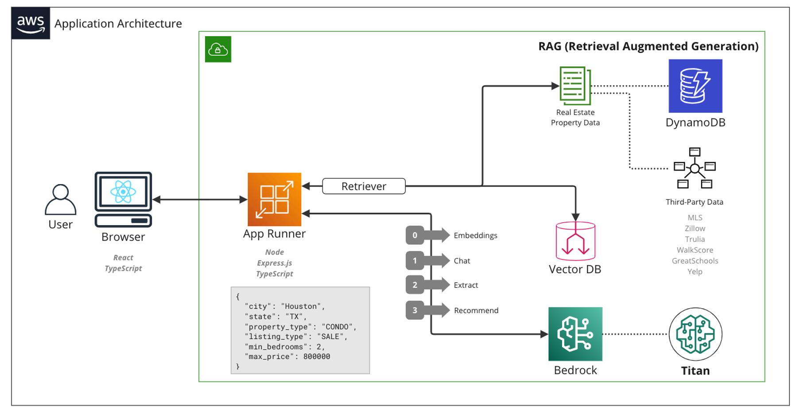

# AI Assistant Context

## Phase 1 platform repos

Sibling repositories under `ai-assistant/` (see [ownership.md](./ownership.md) and [engineering-standards.md](./engineering-standards.md)):

| Repo | Role | Default port |
| ------ | ------ | -------------- |
| `ai-assistant-ui` | Chat UI | 5173 |
| `ai-assistant-backend` | Orchestration | 3001 |
| `ai-assistant-rag` | Retrieve stub | 3002 |
| `ai-assistant-mcp` | MCP `smoke_ping` HTTP | 3003 |
| `ai-assistant-contracts` | `@hazemgharib/ai-agent-contracts` | — |
| `ai-assistant-spec-hub` | Specs / governance | — |

Quickstart: [`../specs/001-platform-foundation/quickstart.md`](../specs/001-platform-foundation/quickstart.md).

## 1. Architecture Diagram









```text
                         ┌──────────────────┐
                         │   Minimal UI     │
                         │ React + TS       │
                         └────────┬─────────┘
                                  │
                                  ▼
                    ┌─────────────────────────┐
                    │     Agent Backend       │
                    │     Node.js + TS        │
                    │                         │
                    │ LLM + orchestration    │
                    └───────┬─────────┬───────┘
                            │         │
                  retrieve  │         │ tools
                            ▼         ▼
                    ┌───────────┐ ┌──────────────┐
                    │    RAG    │ │ MCP Server   │
                    │           │ │              │
                    │ Embedding │ │ tools        │
                    │ Vector DB │ │ resources    │
                    └─────┬─────┘ └──────┬───────┘
                          │              │
                    ┌─────▼─────┐   ┌────▼─────────┐
                    │ Documents │   │ APIs / DB /  │
                    │ PDF/MD/etc│   │ filesystem   │
                    └───────────┘   └──────────────┘
```

### Minimal-cost AWS version

I'd start with:

* **Frontend:** React + TypeScript → static hosting
* **Backend:** Node.js + TypeScript
* **LLM:** Amazon Bedrock
* **Documents:** S3
* **Vector DB:** start with **local/SQLite vector storage**; move to OpenSearch only when needed
* **MCP:** Node.js MCP server
* **Deployment:** start locally → AWS only when you're ready

**Important:** I would *not* start with OpenSearch, ECS, API Gateway, Lambda, etc. just because you're using AWS. They add complexity and potentially cost.

---

## 2. Price Analysis

### Target: $0

For a learning/prototype system:

| Component  | Start with                    |     Cost |
| ---------- | ----------------------------- | -------: |
| React + TS | Local/Vercel/Cloudflare Pages |       $0 |
| Node + TS  | Local                         |       $0 |
| MCP server | Local Node process            |       $0 |
| Vector DB  | SQLite/local                  |       $0 |
| Documents  | Local filesystem              |       $0 |
| LLM        | Local model or API free tier  | $0–few $ |
| AWS        | Don't use initially           |       $0 |

Once you need cloud deployment:

```text
S3          → documents
Bedrock     → LLM + embeddings
OpenSearch  → vector search
EC2/Lambda  → backend
```

At that point, **LLM/token usage becomes the main variable cost**, followed by persistent cloud infrastructure.

For your goal, I'd deliberately build **local-first and cloud-ready**, rather than trying to make every component AWS-native on day one.

---

## 3. Implementation Plan

I'd estimate **~10–12 days** for a solid beginner-friendly prototype.

| Days    | Work                                                 |
| ------- | ---------------------------------------------------- |
| **1**   | TS project + minimal React UI + Node backend         |
| **2–3** | Document ingestion → parsing → chunking → embeddings |
| **4**   | Local vector DB + similarity retrieval               |
| **5**   | RAG prompt + citations/context                       |
| **6–7** | MCP server + 2–3 simple tools                        |
| **8**   | Agent orchestration: decide RAG vs MCP tool          |
| **9**   | Connect UI → agent                                   |
| **10**  | Error handling + conversation state                  |
| **11**  | Evaluation: test retrieval/tool accuracy             |
| **12**  | Cleanup + optional AWS deployment                    |

### The MVP I'd build

Give the agent only **three capabilities** initially:

```text
Agent
 ├── 🔎 search_documents()   ← RAG
 ├── 🌐 fetch_url()          ← MCP
 └── 🧮 calculate()          ← MCP
```

Then test questions like:

> "What does our refund policy say?"
> → RAG
---
> "Fetch the latest information from this URL."
> → MCP
---
> "Calculate the total cost."
> → MCP
---
> "According to our policy, can I get a refund, and calculate how much?"
> → **RAG + MCP**

That last example is particularly useful because it demonstrates the real point of the architecture: **the agent decides which capability to use and can combine them.**
